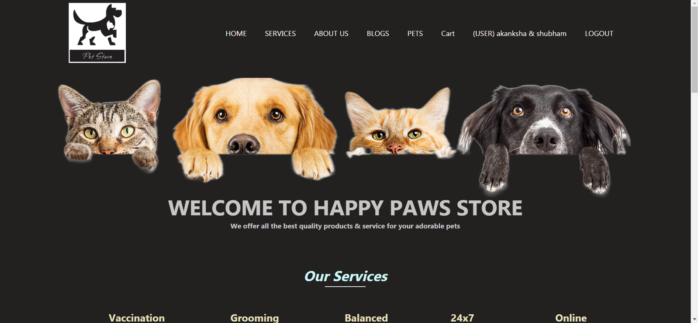
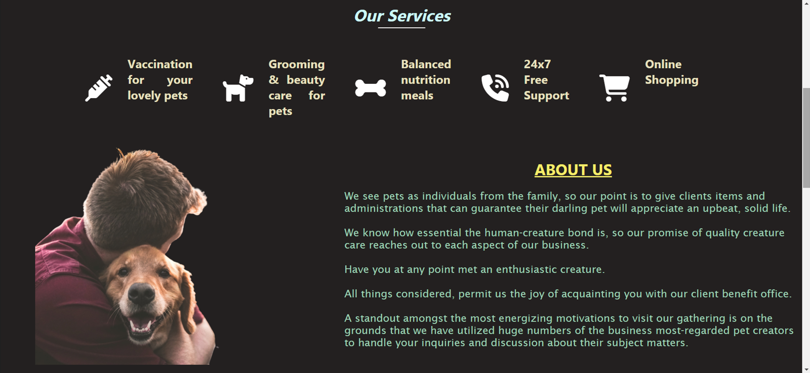
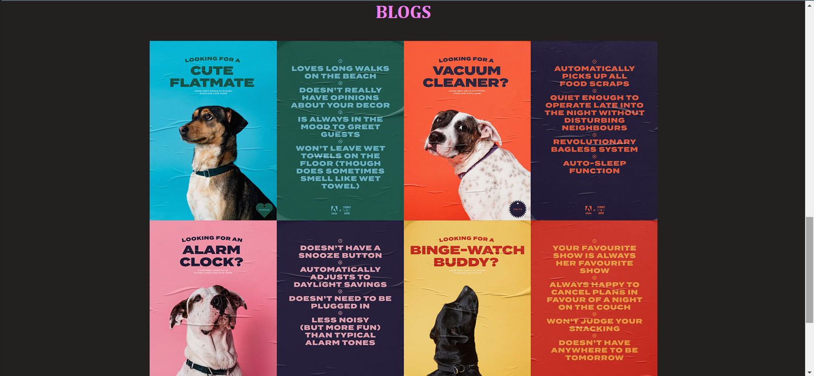
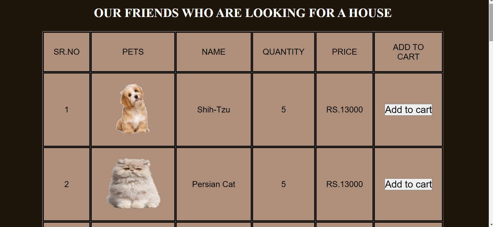
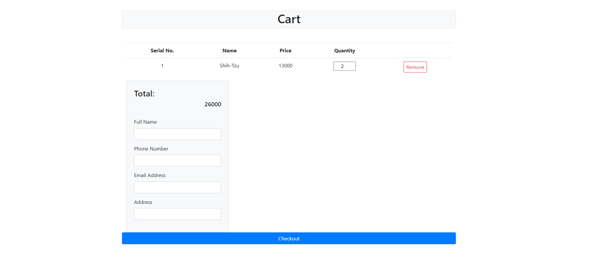
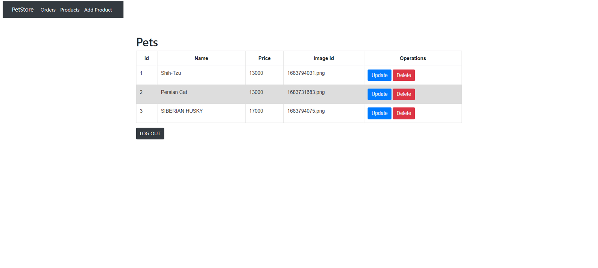
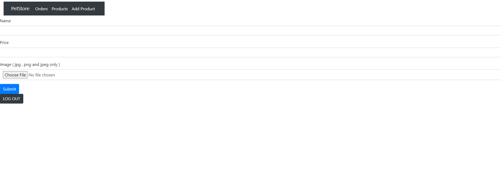

# 🐾 Pet Shop Management System

The **Pet Shop Management System** is a full-stack web application designed to streamline the process of buying pets online. It automates manual operations, making it easier for pet shop owners to manage products and for customers to shop from the comfort of their homes.

## 🚀 Project Objective

The system aims to replace traditional, paper-based processes with a digital platform for:
- Managing pet inventory
- Simplifying order placement and checkout
- Reducing manpower and time consumption
- Improving customer convenience

## 🎯 Features

### 👤 User (Customer)
- 🐶 Browse pet categories and details
- 🛒 Add pets to cart
- ✅ Checkout with order confirmation

### 🔐 Admin (Pet Shop Owner)
- 🔑 Login securely
- ➕ Add new pets to the system
- ✏️ Update existing pet details
- ❌ Delete pets
- 📦 View all customer orders

## 🧠 Motivation

Many pet shops still operate offline, which is time-consuming and inefficient. Our project aims to:
- Help customers find their desired pets faster
- Provide price and breed transparency
- Reduce unnecessary store visits

## 🛠️ Tech Stack

| Component       | Technology             |
|----------------|------------------------|
| Frontend       | HTML, CSS, JavaScript, Bootstrap |
| Backend        | PHP                    |
| Database       | MySQL (via XAMPP)      |
| Hosting (Local)| XAMPP Server           |

## 🖥️ System Requirements

### Software
- Windows OS
- XAMPP Server
- Any modern browser
## 🖼️Pictures

    
    
    
    
    
    
    
    

### Hardware
- Intel Core i5 processor or higher
- 4GB RAM or more
- LCD Monitor, Mouse, Keyboard

## 📌 System Design

- 📊 **ER Diagram & DFD**: Structured system flow and entity relationships
- 🎨 **UI Screens**: Admin login, product dashboard, user login, pet listings, checkout pages

## 📈 Future Scope

- 📷 Backend image upload support
- 💬 Chat feature for real-time communication between customers and store staff

## ✅ Conclusion

This project is a step toward digital transformation in the pet retail industry. It enhances user experience, reduces human errors, and saves time and resources for both customers and store owners.

## 📚 References

- [W3Schools](https://www.w3schools.com)
- [WebDevTrick PHP Cart](https://webdevtrick.com/php-shopping-cart-add-to-cart/)
- [GeeksforGeeks](https://www.geeksforgeeks.org)
- [YouTube Tutorial 1](https://www.youtube.com/watch?v=GUcN9xRpO7U)
- [YouTube Tutorial 2](https://www.youtube.com/watch?v=-aRRH0gZYQw)

---

👩‍💻 Developed by:
- Akanksha Job 

